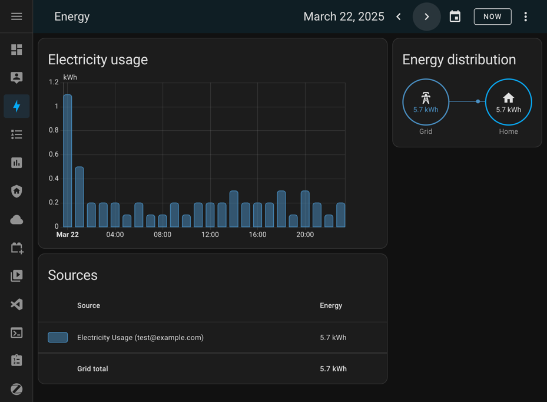
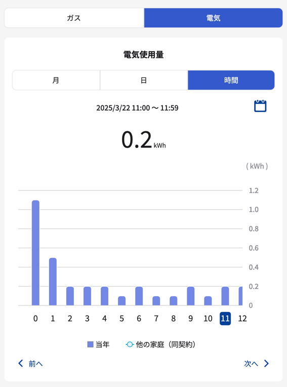
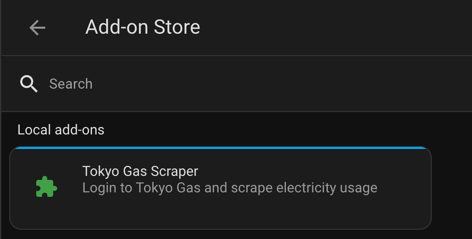
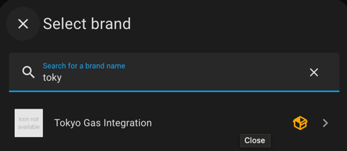
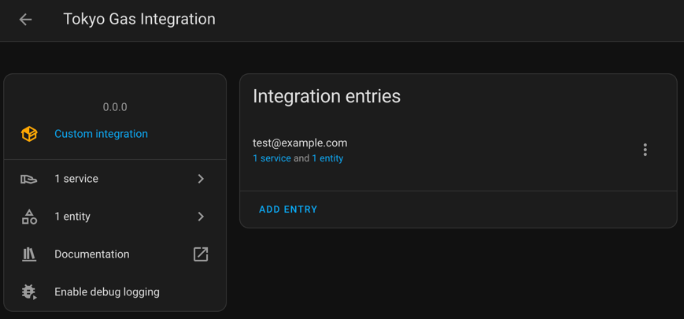
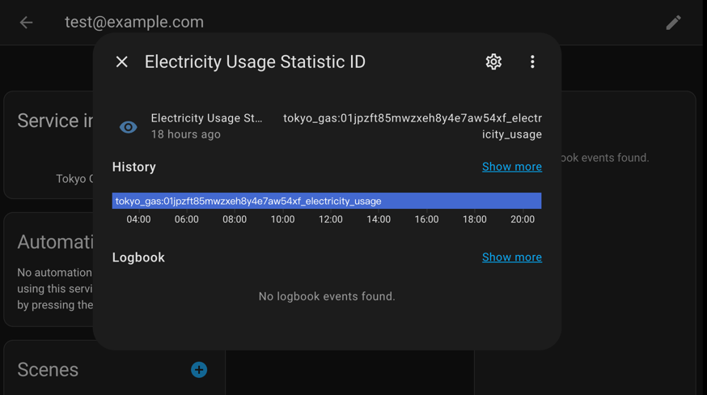

# TokyoGas Scraper for Home Assistant

Scrape electricity usage data from TokyoGas at 14:00 every day. It integrates 
into Home Assistant by addon and custom component. You may add the scraped 
statistics to the Energy dashboard.

> [!WARNING]
> This is still **under construction**. It might be unstable and use it on your
> own risk.

> [!WARNING]
> This is the first time I write Python and extend Home Assistant. The code might
> not be ideal.

## Installation

### Addon

1. Copy the whole `/addon` folder to `/addons/local` in your Home Assistant 
   instance
2. Restart the Home Assistant instance
3. Navigate to `Settings` > `Add-ons` > `Add-on Store` 
   
4. Install the addon
5. By default, the server will be hosted at http://homeassistant.local:8000

### Custom Component

1. Copy the whole `/custom_components/tokyo_gas` folder to 
   `/config/custom_components/tokyo_gas` in your Home Assistant instance
2. Restart the Home Assistant instance
3. Navigate to `Settings` > `Devices & services` > `Add Integration`
   
4. Fill in the login credentials and the domain if you updated the setting

## Usage

After installing the addon and custom component as mentioned above, the data
will be scraped for you automatically at next 14:00 (by default). In case 
there are quite a few integrations, and it might be confusing which statistic
ID should be used, the targeted statistic ID could be viewed in the service.

## Up-coming plans

- Write test cases for all files
- Add options for the addon (e.g. server port)
- Support options modification for custom component after initialization
- Support multiple customer number in one account
